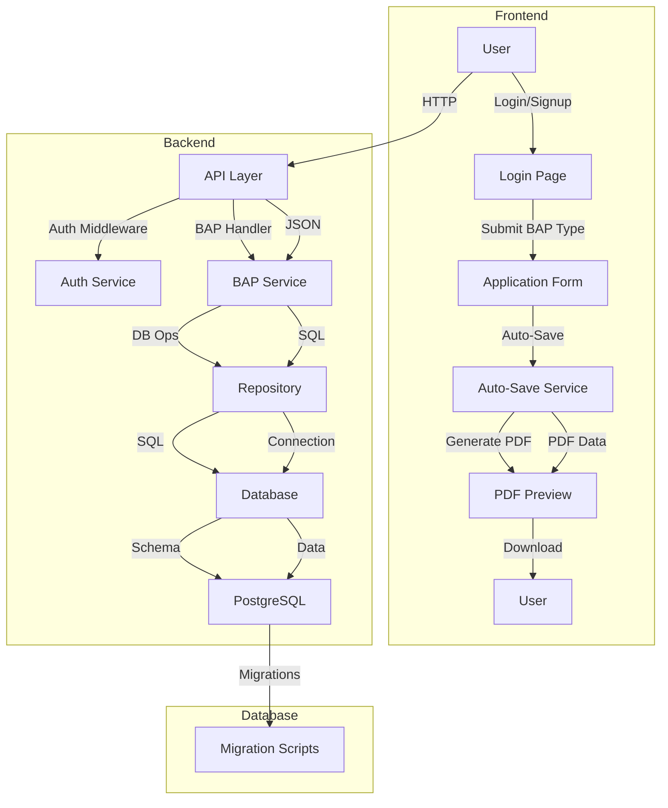

```mermaid
flowchart TD
    %% Frontend
    subgraph Frontend
        A[User] -->|Login/Signup| B[Login Page]
        B -->|Submit BAP Type| C[Application Form]
        C -->|Auto‑Save| D[Auto‑Save Service]
        D -->|Generate PDF| E[PDF Preview]
        E -->|Download| F[User]
    end

    %% Backend
    subgraph Backend
        G[API Layer] -->|Auth Middleware| H[Auth Service]
        G -->|BAP Handler| I[BAP Service]
        I -->|DB Ops| J[Repository]
        J -->|SQL| K[Database]
        K -->|Schema| L[PostgreSQL]
    end

    %% Database
    subgraph Database
        L -->|Migrations| M[Migration Scripts]
    end

    %% Connections
    A -->|HTTP| G
    G -->|JSON| I
    I -->|SQL| J
    J -->|Connection| K
    K -->|Data| L
    D -->|PDF Data| E
```